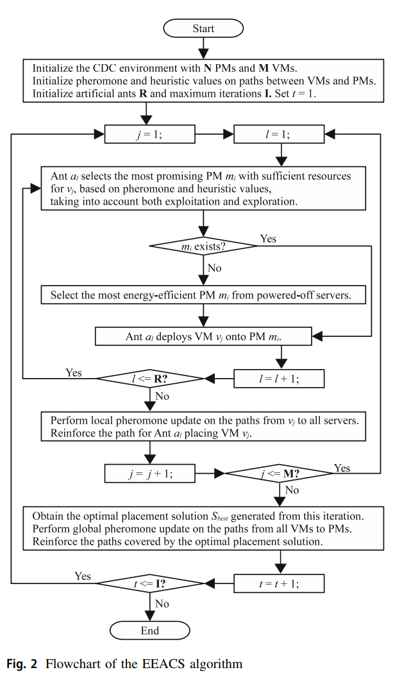
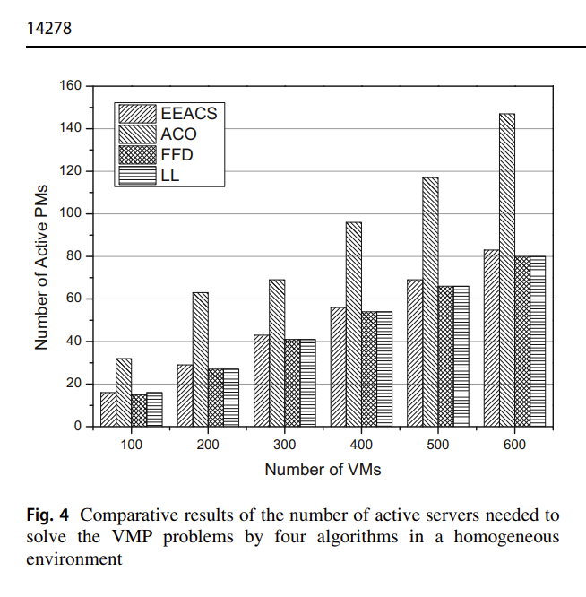
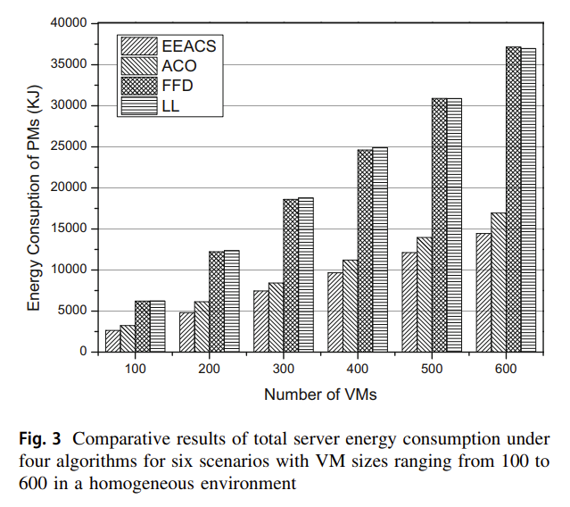

# Biology Inspired Optimization Algorithms

This section covers bin packing solutions using biology optimizers.

## ACO-based Placement Strategy (2024)

DUAN, L.-T.; WANG, J.; WANG, H.-Y. An energy-aware ant colony optimization strategy for virtual machine placement in cloud computing. Cluster Computing: The Journal of Networks, Software Tools and Applications, [s. l.], v. 27, n. 10, p. 14269–14282, 2024. DOI 10.1007/s10586-024-04670-6. Disponível em: https://research.ebsco.com/linkprocessor/plink?id=9abdb06c-b7e4-3dfc-a954-f94eb89dfb4d. Acesso em: 11 jan. 2025. [springer](https://link.springer.com/content/pdf/10.1007/s10586-024-04670-6?pdf=openurl). [pdf](Ant_colony.pdf).

Ant colony optimization (ACO) approximates best-choice selection (eg NP-Hard problems) by creating trails (called _pharamones_) toward leaders or laggard options.

The authors ACO-based placement strategy that is multi-objective to 1/ minimizes the energy consumption and 2/ maximizing the server resource utilization. It models the the `virtual machine` and `physical host` as an energy consumers and blocks. Consumed energy is based on CPU-usage as weighted sum of idle and utilization percentages. 

Beyond the environmential impact, this approach improves the placement of scheduled tasks and bursty processes. This capability is beneficial in scenarios like layer-heuristics with several potential `box-type` or `bins` to target.

Their results also demonstrate the the multi-objective Energy Efficient placement (EEACS) outperforms vanilla ACO and comparable to `Find-First Desending`.

While `Least-Loaded` has similar density to `EEACS`, it has least efficient resource utilization.

## Chemical Reaction Optimization for VM Placement (2019)

Li, Z., Li, Y., Yuan, T., Chen, S., & Jiang, S. (2019). Chemical reaction optimization for virtual machine placement in cloud computing. Applied Intelligence, 49(1), 220–232. https://doi.org/10.1007/s10489-018-1264-5 [pdf](chem_react.pdf).

> This kind of problem is called the virtual machine optimal placement problem. In fact, the virtual machine placement (VMP) problem
can be modeled as a Multi-Packing Problem (MCBPP), which is one of the most popular NP-Hard combinatorial optimization problems. Besides, there are different sized items to be packed into a box of a given capacity. the main objective is to minimize the number of the used boxes. In our case, the items to be packaged can be represented by the VMs and their sizes are represented by the resource utilization.

## A Genetic Algorithm-Based Placement Strategy (2019)

R. Zhang, Y. Chen, B. Dong, F. Tian and Q. Zheng, "A Genetic Algorithm-Based Energy-Efficient Container Placement Strategy in CaaS," in IEEE Access, vol. 7, pp. 121360-121373, 2019, doi: 10.1109/ACCESS.2019.2937553. keywords: {Containers; Energy consumption; Genetic algorithms;Servers;Biological cells;Resource management;Degradation;CaaS;container placement;genetic algorithm;exchange mutation operation} [IEEE](https://ieeexplore.ieee.org/document/8813096). [pdf](A_Genetic_Algorithm-Based_Energy-Efficient_Container_Placement_Strategy_in_CaaS.pdf)
