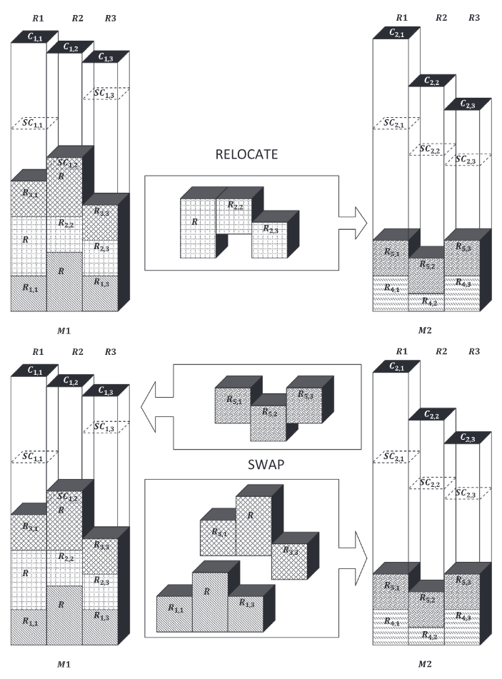
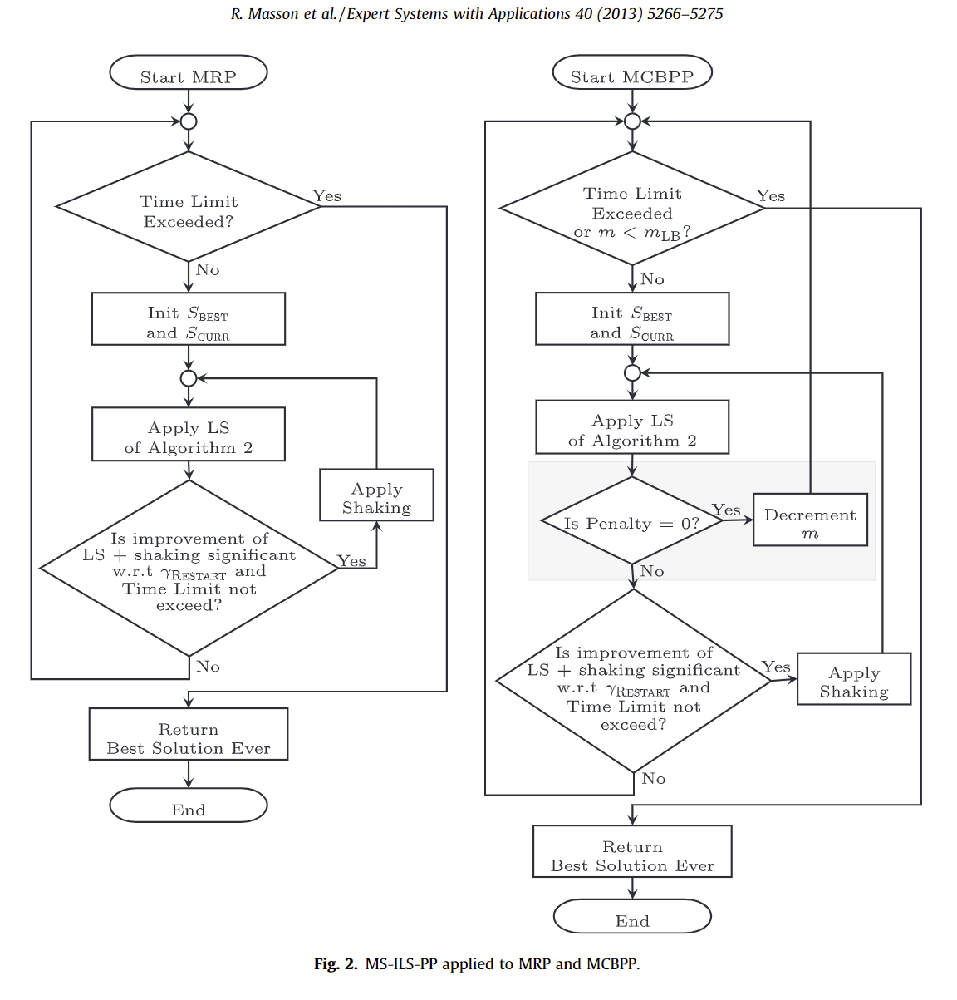

# Machine Reassignment Problems

Given a cohort of machines, what' the best place to run an application? An impossible problem to answer, but there's plenty of approximations for these `Multi-capacity Bin Packing Problems (MCBPP)`.

## Iterated Local Search for MCBPP (2013)

Masson, R., Vidal, T., Michallet, J., Penna, P. H. V., Petrucci, V., Subramanian, A., & Dubedout, H. (2013). An iterated local search heuristic for multi-capacity bin packing and machine reassignment problems. Expert Systems with Applications, 40(13), 5266–5275. [doi](https://doi.org/10.1016/j.eswa.2013.03.037). [pdf](local_search_MCBPP.pdf)

### MCBPP relation to MRP 

> The problem of allocating a set of processes across a pool of server machines is basically a bin-packing problem where each of the machines is a bin. The goal is to allocate as many processes as possible into each bin, while respecting multiple capacity constraints. This problem is referred in the literature as the **Multi-Capacity Bin Packing Problem (MCBPP)**, also known as the **Vector Bin Packing Problem**. In a more complex scenario, we consider the **Machine Reassignment Problem (MRP)** which consists of optimizing the usage of available machine resources by reallocating processes to different machines in a cost-efficient manner.

The authors provide formal descriptions and definitions for these three variations. There are also formal definitions for [Google's MRP dataset](https://roadef.org/challenge/2012/en/index.php). 

### Shaking Operators

> Shaking operators are potentially-deteriorating moves which provide the means to escape from locally optimal solutions. Two shaking operators are considered in the proposed method, and called in turn. Note that only feasible shaking moves are applied.

- The **Home Relocate shaking operator** selects randomly nprocesses that are currently not hosted on their initial machine, and relocates them to their initial machine. This move tends to be par-ticularly efficient for reducing the process move costs in MRP context.
- The **K-Swap shaking operator** randomly selects ntimes a pair of machines, and performs a swap of random groups of either 3, 4, or 5 processes, with equal probability, among these machines. These two operators modify the solution in such a way that it cannot be directly reversed by simply applying a single local-search move.

### Local Search Process

## Survey of Approaches to Google Machine Reassignment Problem (2020)

Dario Canales, Nicolas Rojas-Morales, & Maria-Cristina Riff. (2020). A Survey and a Classification of Recent Approaches to Solve the Google Machine Reassignment Problem. IEEE Access, 8, 88815–88829. [doi](https://doi.org/10.1109/ACCESS.2020.2993563). [pdf](A_Survey_and_a_Classification_of_Recent_Approaches_to_Solve_the_Google_Machine_Reassignment_Problem.pdf)

The author survey recent publications against the __Google Machine Reassignment Problem (GMRP)__; which formalized the research challenge in 2010. Numerous publications address different aspects of the problem (e.g., runtime calculation perform, resource density utilization, etc.). under varying constraints.

The Google Machine Reassignment Problem (GMRP) consider the following `components`:
- **Processes**: elements that need to be assigned considering their resource requirements.
- **Services**: can be considered as sets of processes. Services have dependence relationships, which are traduced into constraints of the problem.
- **Machines**: equipment to which processes will be assigned. Each machine has a set of available resources with a defined capacity. These resources will be consumed by some assigned processes.
- **Location**: is defined as a set of machines. A location defines how processes of a particular service should
be distributed (among machines of different locations). Moreover, for each service, a minimum number of locations where their processes should be assigned is defined (spreadmin). All locations are disjoint sets.
- **Neighborhood**: is defined as a set of machines. When a dependence relationship between services exists, processes should be assigned on machines of the same neighborhood. All neighborhoods are disjoint sets

### What constraints appeared

> To determine the quality of a candidate solution, the objective function considers a weighted sum of a Load Cost, a Balance Cost, a Process Move Cost, a Service Move Cost, and a Machine Move Cost. The problem also considers a set of constraints that are related to the capacity of themachines, the usage of resources, dependency, among others. For example, each process has system requirements of various resources like CPU, RAM and Hard Disk. On the other hand, machines have a certain capacity limit for each resource. These resources are consumed by each assigned
process.

### What cost objectives are in scope

These are the different costs dimensions to proceeding evaluates; using operations like:

- **Shift**: move one process to another machine,
- **Swap**: interchanges two processes from different
machines,
- **Chain**: shift a defined number of processes at the same time,
- **Big Process Rearrangement (BPR)**: reassign big processes to a target machine. For this, other smaller processes could be also reassigned to generate enough
space.

Other papers extended the action space to include:

- **Backtracking**: perform an update based on subproblem
- **Double Shift**: tries to perform Shift operator re-assigning other processes if it is necessary

### Using item centric heuristics

> Authors conclude that instances can be decomposed into smaller subproblems and showed that the mentioned heuristics can be adapted to the MRP. Based on this, a multi-start algorithm was proposed to generate feasible solutions assigning all processes (instead of using the provided initial solution s0). Even though the MRP is a very constrained problem, the proposed heuristics were able to assign more than the 90% of the processes in all the instances. Authors denote that the best heuristics, in terms of the number of feasible solutions, were the item centric heuristics with priorities on processes and machines (randomly ordered or normalized by bins capacities).

## Heuristic for Container Load Problem (2006)

Z. Wang, K. W. Li and X. Zhang, "A Heuristic Algorithm for the Container Loading Problem with Heterogeneous Boxes," 2006 IEEE International Conference on Systems, Man and Cybernetics, Taipei, Taiwan, 2006, pp. 5240-5245, doi: 10.1109/ICSMC.2006.385140. keywords: {Heuristic algorithms;Containers;Partitioning algorithms;Polynomials;Cybernetics;Filling;Acceleration;Globalization;Marine transportation;Rail transportation}, [pdf](A_Heuristic_Algorithm_for_the_Container_Loading_Problem_with_Heterogeneous_Boxes.pdf).

## MCBPP Job Scheduling under constraints (1999)

W. Leinberger, G. Karypis and V. Kumar, "Multi-capacity bin packing algorithms with applications to job scheduling under multiple constraints," Proceedings of the 1999 International Conference on Parallel Processing, Aizu-Wakamatsu, Japan, 1999, pp. 404-412, doi: 10.1109/ICPP.1999.797428. keywords: {Scheduling algorithm;Application software;Processor scheduling;Computational modeling;Contracts;World Wide Web;Computer science;NASA;High performance computing;Military computing} [IEEE](https://ieeexplore.ieee.org/document/797428). [pdf](Multi-capacity_bin_packing_algorithms_with_applications_to_job_scheduling_under_multiple_constraints.pdf).

## Traffic aware VM-packing (2016)

Liu, J., Guo, J., & Ma, D. (2016). Traffic Aware Virtual Machine Packing in Cloud Data Centers. 2016 IEEE 2nd International Conference on Big Data Security on Cloud (BigDataSecurity), IEEE International Conference on High Performance and Smart Computing (HPSC), and IEEE International Conference on Intelligent Data and Security (IDS), Big Data Security on Cloud (BigDataSecurity), IEEE International Conference on High Performance and Smart Computing (HPSC), and IEEE International Conference on Intelligent Data and Security (IDS), 2016 IEEE 2nd International Conference On, 256–261. [doi](https://doi.org/10.1109/BigDataSecurity-HPSC-IDS.2016.37). [pdf](Traffic_Aware_Virtual_Machine_Packing_in_Cloud_Data_Centers.pdf).

