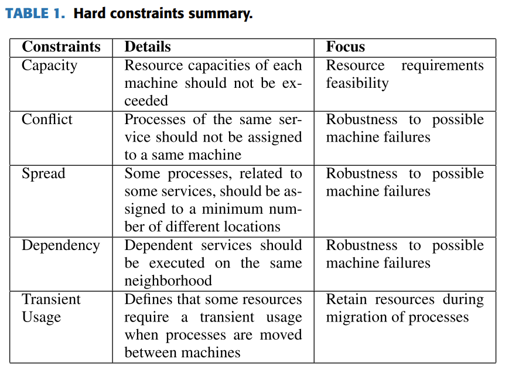
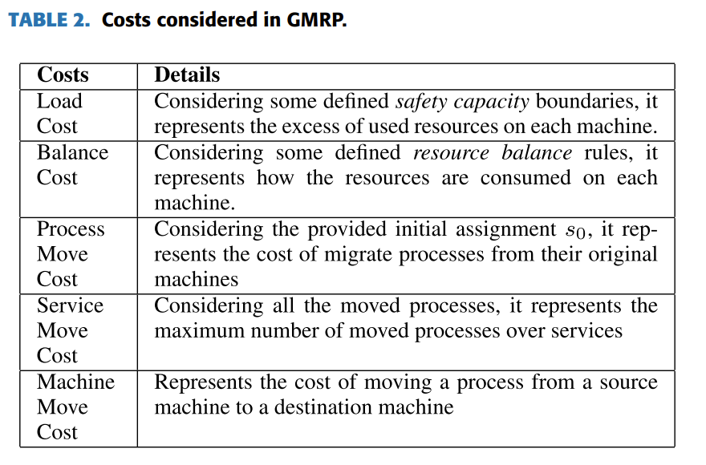

# Machine Reassignment Problems

Given a cohort of machines, what' the best place to run an application? An impossible problem to answer, but there's plenty of approximations for these `Multi-capacity Bin Packing Problems (MCBPP)`.

## Survey of Approaches to Google Machine Reassignment Problem (2020)

Dario Canales, Nicolas Rojas-Morales, & Maria-Cristina Riff. (2020). A Survey and a Classification of Recent Approaches to Solve the Google Machine Reassignment Problem. IEEE Access, 8, 88815–88829. [doi](https://doi.org/10.1109/ACCESS.2020.2993563). [pdf](A_Survey_and_a_Classification_of_Recent_Approaches_to_Solve_the_Google_Machine_Reassignment_Problem.pdf)

The author survey recent publications against the __Google Machine Reassignment Problem (GMRP)__; which formalized the research challenge in 2010. Numerous publications address different aspects of the problem (e.g., runtime calculation perform, resource density utilization, etc.). under varying constraints.

The Google Machine Reassignment Problem (GMRP) consider the following `components`:
- **Processes**: elements that need to be assigned considering their resource requirements.
- **Services**: can be considered as sets of processes. Services have dependence relationships, which are traduced into constraints of the problem.
- **Machines**: equipment to which processes will be assigned. Each machine has a set of available resources with a defined capacity. These resources will be consumed by some assigned processes.
- **Location**: is defined as a set of machines. A location defines how processes of a particular service should
be distributed (among machines of different locations). Moreover, for each service, a minimum number of locations where their processes should be assigned is defined (spreadmin). All locations are disjoint sets.
- **Neighborhood**: is defined as a set of machines. When a dependence relationship between services exists, processes should be assigned on machines of the same neighborhood. All neighborhoods are disjoint sets

> To determine the quality of a candidate solution, the objective function considers a weighted sum of a Load Cost, a Balance Cost, a Process Move Cost, a Service Move Cost, and a Machine Move Cost. The problem also considers a set of constraints that are related to the capacity of themachines, the usage of resources, dependency, among others. For example, each process has system requirements of various resources like CPU, RAM and Hard Disk. On the other hand, machines have a certain capacity limit for each resource. These resources are consumed by each assigned
process.

These are the different costs dimensions to evaluate: 

## Iterated local search for MCBPP (2013)

Masson, R., Vidal, T., Michallet, J., Penna, P. H. V., Petrucci, V., Subramanian, A., & Dubedout, H. (2013). An iterated local search heuristic for multi-capacity bin packing and machine reassignment problems. Expert Systems with Applications, 40(13), 5266–5275. [doi](https://doi.org/10.1016/j.eswa.2013.03.037). [pdf](local_search_MCBPP.pdf)

## Heuristic for Container Load Problem (2006)

Z. Wang, K. W. Li and X. Zhang, "A Heuristic Algorithm for the Container Loading Problem with Heterogeneous Boxes," 2006 IEEE International Conference on Systems, Man and Cybernetics, Taipei, Taiwan, 2006, pp. 5240-5245, doi: 10.1109/ICSMC.2006.385140. keywords: {Heuristic algorithms;Containers;Partitioning algorithms;Polynomials;Cybernetics;Filling;Acceleration;Globalization;Marine transportation;Rail transportation}, [pdf](A_Heuristic_Algorithm_for_the_Container_Loading_Problem_with_Heterogeneous_Boxes.pdf).

