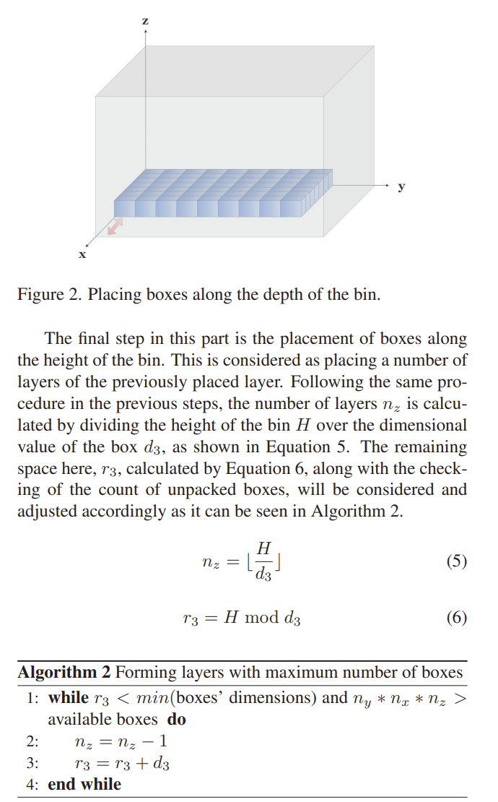

# Multi-dimensional Binpack

Multi-dimensional bin-packing occurs across industries, such as shipping, where different shaped `boxes` are sorted into the minimal `bins` that's total `weight` remains under a `limit`.

## Smart shipment (2020)

Y. Harrath, M. Aljassim and L. M. Anees, "Smart shipment: An efficient algorithm for packing three-dimensional bins," 3rd Smart Cities Symposium (SCS 2020), Online Conference, 2020, pp. 203-208, doi: 10.1049/icp.2021.0907. [IEEE](https://ieeexplore.ieee.org/document/9545694). [pdf](Harrath_2020.pdf).

The authors provide an efficient method to place boxes within 3D bins, where rotation is available. By re-orienting the box you can more densely pack the container. 

> The proposed solution is composed of two main parts called **setting boundaries** and **filling remaining spaces** to fill a single bin with a number of boxes. The two parts of the algorithm will be repeated until the last box is packed successfully inside a bin. 

The researchers constrain the problem to:

- A `bin` is defined has dimensions (length, width, and depth); assumed decreasing values.
- A `box` has dimensions (length, width, and depth); order is not required.
- A `box-type` maps an identifier to known LWD-tuple.

### Evaluated Algorithms

- The `First Fit Decreasing` and `The Best Fit` are greedy algos often appear because of their fast runtime reaching *an optimal*. By examing the ratio of `sum(used_space)` versus `sum(wasted_space)`, you can compare different solutions produced. 

- The `bin-pack3d` method uses a depth-first search to recursivly find optimal combinations. Researchers compared various versions and found that *sorting the boxes in their non-increasing volumes and then branching them into pairs. The relative position of the largest boxes was obtained in the beginning of the algorithm and infeasibility could be known at the earliest*. 

- The `Layer-Based Heuristic` divides the bin into independent `layers`. By considers the volume, weight this approach substantually reduced the number of bins and improved runtime. Previous researchers didn't consider reorientation or mixed box types.

- The `Multi objective 3D Bin` algo that s focusing on simultaneous objectives that mainly concentrates on efficiency packing and balancing the
weight of the bins. The only drawback faced by that algorithm was the large amount of wasted space in the bins which could not be filled. Similarly, using `Particle-Swarm Optimiziton`, researchers demonstrate methods for suitable placement (not minimum set).

### Setting boundaries

This operations places homogenous boxes across the layeres and determining the unused space. The most efficient usage comes from rotating by shifting the LWD-tuple (e.g., `xyz` > `zxy`) then **calculating how many potential boxes might fit and selecting the maximum orientation**.

Next, the task aligns the potential boxes along the length (largest-dimension), attempting to populate the row. 

This operation repeats for k-rows until the layer is best populated. 

### Filling Gaps

After completing every placement there will be gaps. These are populated by selecting the `unused-space` (see red) and iteratively repeating the process. Since the placement targets the dimensions in decending order (length > width > depth); there's only one `inner-bin` to handle.

.

You must start by selecting the `box-type` with the maximum length that fits. Often a shortcut exists by first rotating the `box` to have decending dimensions (length > width > depth) before checking. 

## An Improvement of a Heuristic Algorithm for 3D Bin-Packing Problem (2024)

S. Krisadee and W. Jindaluang, "An Improvement of a Heuristic Algorithm for 3D Bin-Packing Problem," 2024 28th International Computer Science and Engineering Conference (ICSEC), Khon Kaen, Thailand, 2024, pp. 1-6, doi: 10.1109/ICSEC62781.2024.10770638. keywords: {Computer science;Three-dimensional displays;Shape;Heuristic algorithms;Memory management;3D bin-packing problem;spatial layer-based heuristic;Three-Stage Layer-Based Heuristic (TSLBH)}. [IEEE](https://ieeexplore.ieee.org/document/10770638). [pdf](An_Improvement_of_a_Heuristic_Algorithm_for_3D_Bin-Packing_Problem.pdf).

The authors propose a procedure using a three-staged version of [Y. Harrath's 3D bin-packing algorithm](Harrath_2020.pdf). This approach reduces (bins, processing time, and memory) decreased to (39%, 58%, and 64%) for large bin counts.

> There are numerous approaches to solving the 3D binpacking problem. One of the basic concepts for solving this problem is the Layer-Based Heuristic approach, as described by [5]. This method uses heuristics to find solutions in each layer within the bin, as illustrated in Fig.2. The approach involves selecting the appropriate type and number of boxes for each layer until no more boxes can fit, indicating the completion of packing for that bin. 

### The issue of using the maximum volume pattern

> As seen in Fig.6, selecting a layout with the largest volume only might notnachieve the goal of utilizing the fewest number of bins. There
may be only one type of box in the pattern with the maximum volume. As shown in this figure, a pattern with the maximum volume indicates that we should pack a box of type 2 with an amount of 147. Meanwhile, in a configuration, we have 3 types of boxes with amounts 17, 7, and 76, respectively.

Harrath's algorithm begins the **setting bounds** operation by placing homogenous boxes. This is efficient when the `count(box-type)` is low, but more likely to have gaps and changing patterns is high. 

The authors address this through a memorization optimization technique during the layered-heuristic's second and third stage. 

## ACO-based Placement Strategy (2024)

DUAN, L.-T.; WANG, J.; WANG, H.-Y. An energy-aware ant colony optimization strategy for virtual machine placement in cloud computing. Cluster Computing: The Journal of Networks, Software Tools and Applications, [s. l.], v. 27, n. 10, p. 14269–14282, 2024. DOI 10.1007/s10586-024-04670-6. Disponível em: https://research.ebsco.com/linkprocessor/plink?id=9abdb06c-b7e4-3dfc-a954-f94eb89dfb4d. Acesso em: 11 jan. 2025. [springer](https://link.springer.com/content/pdf/10.1007/s10586-024-04670-6?pdf=openurl). [pdf](Ant_colony.pdf).

The authors propose an ACO-based placement strategy that minimizes the energy consumption and maximizing the server resource utilization. It models the the `virtual machine` and `physical host` as an energy consumers and blocks. Consumed energy is based on CPU-usage as weighted sum of idle and utilization percentages. 

Beyond the environmential impact, this approach improves the placement of scheduled tasks and bursty processes. This capability is beneficial in scenarios like layer-heuristics with several potential `box-type` or `bins` to target.

Their results also demonstrate the the multi-objective Energy Efficient placement (EEACS) outperforms vanilla ACO and comparable to `Find-First Desending`.

While `Least-Loaded` has similar density to `EEACS`, it has least efficient resource utilization.

## A Genetic Algorithm-Based Placement Strategy (2019)

R. Zhang, Y. Chen, B. Dong, F. Tian and Q. Zheng, "A Genetic Algorithm-Based Energy-Efficient Container Placement Strategy in CaaS," in IEEE Access, vol. 7, pp. 121360-121373, 2019, doi: 10.1109/ACCESS.2019.2937553. keywords: {Containers; Energy consumption; Genetic algorithms;Servers;Biological cells;Resource management;Degradation;CaaS;container placement;genetic algorithm;exchange mutation operation} [IEEE](https://ieeexplore.ieee.org/document/8813096). [pdf](A_Genetic_Algorithm-Based_Energy-Efficient_Container_Placement_Strategy_in_CaaS.pdf)

## A new approach for bin packing problem using knowledge reuse and improved heuristic (2024)

Fang, J., Chen, X., Rao, Y., Peng, Y., & Yan, K. (2024). A new approach for bin packing problem using knowledge reuse and improved heuristic. Scientific Reports, 14(1), 1-20. [doi](https://doi.org/10.1038/s41598-024-81749-5). [pdf](Knowledge_Reuse.pdf).
